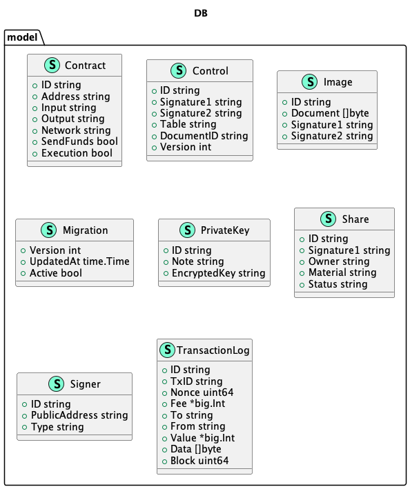

# QLDB test 2:
- make run-test-app:
  - executes the main app that test several SQL applications

- make run-migrates:
  - executes the migrations to create the tables and indexes

# Important directories:
- /pkg/model: contains the models of the tables
- /sql: contains the SQL files to create the tables and indexes
- /storage: contains the functions to interact with the database
- /cmd: contains the main app to test the database

-- Database Structs Diagram:
